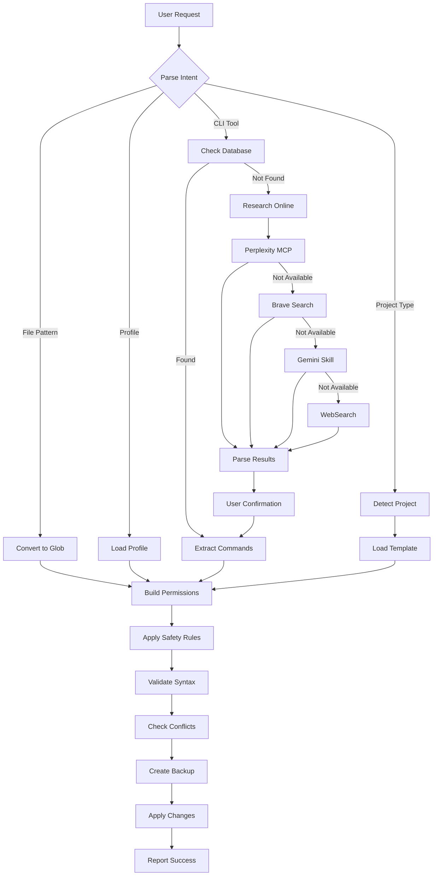

# Claude Permissions Manager

> Intelligent, proactive permission management for Claude Code that eliminates configuration friction.

[](https://opensource.org/licenses/MIT)
[](https://claude.ai/code)
[](https://github.com/SpillwaveSolutions/claude_permissions_skill)
[](https://skillzwave.ai/skill/SpillwaveSolutions__claude_permissions_skill__claude-permissions__SKILL/)

Tired of manually configuring Claude Code permissions? This skill transforms permission management from tedious JSON editing into simple, natural language conversations. Just say what you want to enable, and the skill handles the rest - automatically, safely, and intelligently.

## Why This Skill?

**Before:**
- Manually edit ~/.claude/settings.json
- Look up permission syntax
- Remember which commands are safe
- Forget to deny sensitive files
- Get stuck on unknown tools

**After:**
- "enable git" - Auto-adds safe git commands
- "make markdown files editable" - Instant configuration
- "this is a Rust project" - Complete setup in seconds
- "enable terraform" - Automatic research and configuration
- Safety rules applied automatically

---

## Installation

### Option 1: Skilz Universal Installer (Recommended)

The easiest way to install this skill is via the [Skilz Universal Installer](https://github.com/AgenDev-ai/skilz):

```bash
# Install skilz CLI (if not already installed)
npm install -g skilz

# Install this skill
skilz install SpillwaveSolutions_claude_permissions_skill/claude-permissions
```

**Or use npx without global installation:**

```bash
npx skilz install SpillwaveSolutions_claude_permissions_skill/claude-permissions
```

View this skill on the marketplace: [skillzwave.ai/skill/SpillwaveSolutions__claude_permissions_skill__claude-permissions__SKILL/](https://skillzwave.ai/skill/SpillwaveSolutions__claude_permissions_skill__claude-permissions__SKILL/)

### Option 2: Git Clone (Manual)

Clone this repository directly into your Claude Code skills directory:

```bash
cd ~/.claude/skills
git clone https://github.com/SpillwaveSolutions/claude_permissions_skill.git claude-permissions
```

### Verify Installation

After installation, the skill is immediately available to Claude Code. No restart required.

---

## Quick Start

Start Claude Code and try:

```
User: "enable git read commands"
```

Claude will automatically:
- Add read-only git permissions (status, log, diff, show, branch)
- Apply safety deny rules (no `--force` operations)
- Create a backup of your settings
- Validate the configuration
- Confirm what was added

### More Examples

```bash
# Make all markdown files editable
"make all markdown files editable"

# Set up a TypeScript project
"this is a TypeScript project, make it editable"

# Enable write operations for git
"enable git commits and pushes"

# Enable GCP read commands
"enable gcloud list and describe commands"

# Apply a pre-built profile
"apply development profile"
```

---

## Key Features

### 1. Natural Language Understanding

Stop editing JSON. Just describe what you want:

| What You Say | What Happens |
|--------------|--------------|
| "enable git" | Adds read-only git commands |
| "enable git pushes" | Adds write git operations + safety rules |
| "make Rust files editable" | Adds `.rs` file patterns + cargo commands |
| "this is a TypeScript project" | Complete TypeScript + npm setup |
| "enable kubectl read commands" | Adds kubernetes read-only operations |

### 2. Built-in Knowledge for 17 CLI Tools

Pre-configured with read vs write operations for:

**Version Control & Collaboration:**
- `git` - Distributed version control

**Cloud Platforms:**
- `gcloud` (Google Cloud)
- `aws` (Amazon Web Services)
- `az` (Microsoft Azure)

**Containers & Orchestration:**
- `docker` - Container platform
- `kubectl` - Kubernetes control
- `helm` - Kubernetes package manager

**Build Tools & Package Managers:**
- `npm`, `yarn` (JavaScript/Node.js)
- `pip` (Python)
- `maven`, `gradle` (Java)
- `cargo` (Rust)
- `go` (Go)
- `bundle` (Ruby)
- `composer` (PHP)

**Infrastructure as Code:**
- `terraform` - Multi-cloud IaC
- `pulumi` - Modern IaC
- `ansible` - IT automation

**AI CLIs:**
- `claude` - Claude Code CLI
- `gemini` - Gemini CLI

Each tool has carefully curated lists of:
- **Read-only operations** (safe, recommended)
- **Write operations** (with appropriate safeguards)
- **Dangerous operations** (auto-denied)

### 3. Auto-Detection for 12+ Languages

Automatically detects project type and applies appropriate templates:

```
Cargo.toml              -> Rust project
pom.xml                 -> Java Maven
build.gradle            -> Java Gradle
package.json + tsconfig -> TypeScript
package.json (only)     -> JavaScript
pyproject.toml          -> Python
go.mod                  -> Go
Gemfile                 -> Ruby
composer.json           -> PHP
*.csproj                -> C#
CMakeLists.txt          -> C++
Package.swift           -> Swift
```

Each template includes:
- File editing patterns (`.rs`, `.java`, `.ts`, etc.)
- Build tool commands (safe operations only)
- Deny rules for build artifacts and sensitive files

### 4. Research Mode for Unknown Tools

Encountered a tool not in the database? No problem!

**Automatic research workflow:**
1. Check built-in database (`cli_commands.json`)
2. Research using (in priority order):
   - Perplexity MCP (if available)
   - Brave Search MCP
   - Gemini skill (if available)
   - Built-in WebSearch
3. Parse results for read vs write operations
4. Present findings to user for confirmation
5. Apply permissions
6. Optionally cache for future use

**Example with Terraform (unknown tool):**
```
User: "enable terraform read commands"

Claude:
  Checking database... not found
  Researching via Perplexity...

  Found these read-only commands:
  - terraform plan (preview changes)
  - terraform show (display state)
  - terraform validate (check syntax)
  - terraform state list (list resources)
  - terraform output (show outputs)

  Write commands (will be denied):
  - terraform apply (create resources)
  - terraform destroy (delete resources)

  Should I add the read-only commands? (y/n)

User: y

Claude:
  Added 5 terraform read commands
  Denied terraform apply, destroy
  Backup created: ~/.claude/settings.20250116_143022.backup
```

### 5. Safety-First by Design

**Every permission change includes automatic deny rules for:**

**Sensitive Files:**
```
.env, .env.*           - Environment variables
*.key, *.pem           - Private keys & certificates
.aws/**, .ssh/**       - Cloud & SSH credentials
secrets/**             - Secrets directories
credentials/**         - Credential files
```

**Dangerous Commands:**
```
rm *, rm -rf           - File deletion
sudo *                 - Privilege escalation
chmod, chown           - Permission changes
dd, mkfs               - Disk operations
curl * | bash          - Pipe to shell execution
```

**Force Operations:**
```
git push --force       - Force push
git reset --hard       - Hard reset
docker rm -f           - Force container removal
terraform destroy      - Infrastructure destruction
```

**Production Deployments:**
```
npm publish            - NPM registry
mvn deploy             - Maven repository
cargo publish          - Crates.io
docker push *prod*     - Production images
```

**Three security levels available:**
- `minimal` (5 rules) - Basic protection
- `standard` (13 rules) - Recommended default
- `strict` (25 rules) - Maximum security

### 6. Configuration Backup & Validation

Before **every** change:
1. Creates timestamped backup (`settings.YYYYMMDD_HHMMSS.backup`)
2. Validates permission syntax
3. Checks for conflicts (allow vs deny)
4. Warns about security issues
5. Applies changes safely
6. Reports what was changed

**Easy rollback:**
```bash
# List available backups
ls -la ~/.claude/settings.*.backup

# Restore from backup
cp ~/.claude/settings.20250116_143022.backup ~/.claude/settings.json
```

---

## Permission Profiles

Pre-built profiles for common workflows:

### Development Profile
**Use case:** Active feature development

```json
{
  "allows": [
    "Full editing of src/, test/, docs/",
    "Git read + write (no --force)",
    "Build tool commands (test, compile, build)",
    "Package manager (install, test)"
  ],
  "denies": [
    "Sensitive files (.env, .key, .pem)",
    "Dangerous commands (rm, sudo)",
    "Production deployments (publish, deploy)",
    "Build artifacts (target/, node_modules/)"
  ]
}
```

### CI/CD Profile
**Use case:** Continuous integration pipelines

```json
{
  "allows": [
    "Read access only",
    "Git read commands",
    "Build and test commands",
    "Docker build and tag"
  ],
  "denies": [
    "All writes",
    "Git push",
    "Docker push",
    "Deployment commands"
  ]
}
```

### Read-Only Profile
**Use case:** Code review, security audit

```json
{
  "allows": [
    "Read access only"
  ],
  "denies": [
    "All writes and edits",
    "All bash commands",
    "Web access"
  ]
}
```

**All 7 profiles:**
- `read-only` - Code review, audit
- `development` - Active development (recommended)
- `ci-cd` - Automated testing
- `production` - Monitoring only
- `documentation` - Docs writing
- `code-review` - PR review
- `testing` - TDD workflow

**Apply a profile:**
```
User: "apply development profile"
User: "use read-only profile"
User: "set up CI/CD permissions"
```

---

## Advanced Usage

### Standalone Python Scripts

All functionality is also available as standalone Python scripts:

```bash
# Navigate to skill directory
cd ~/.claude/skills/claude-permissions

# Apply specific permissions
python3 scripts/apply_permissions.py \
  --add "Bash(git status)" \
  --add "Bash(git log)" \
  --add "Write(**.md)"

# Apply a profile
python3 scripts/apply_permissions.py --profile development

# Use global settings instead of project
python3 scripts/apply_permissions.py --global --add "Read"

# Add deny rules
python3 scripts/apply_permissions.py \
  --deny "Bash(rm *)" \
  --deny "Read(.env*)"

# Detect current project type
python3 scripts/detect_project.py
python3 scripts/detect_project.py --permissions  # Show recommended perms

# Validate configuration
python3 scripts/validate_config.py ~/.claude/settings.json
python3 scripts/validate_config.py ~/.claude/settings.json -v  # Verbose

# Get help
python3 scripts/apply_permissions.py --help
```

### Configuration File Hierarchy

Claude Code uses a hierarchical config system (highest priority first):

```
1. Command-line arguments    (--allowedTools flag)
2. Enterprise policies        (if applicable)
3. .claude/settings.local.json   (git-ignored, personal)
4. .claude/settings.json         (version controlled, team)
5. ~/.claude/settings.json       (user global)
6. ~/.claude.json                (legacy global)
```

**Default behavior:**
- Applies to **project settings** if in a project directory
- Otherwise applies to **user global settings**

**Specify location explicitly:**
```
User: "enable git and add to global settings"
User: "make markdown editable in project settings only"
```

### Scoped File Patterns

Support for directory-specific permissions:

```
User: "make files in src/ editable"
-> Adds: Write(src/**), Edit(src/**)

User: "allow editing docs folder"
-> Adds: Write(docs/**), Edit(docs/**)

User: "enable TypeScript in src only"
-> Adds: Write(src/**.ts), Write(src/**.tsx)
```

---

## Architecture

### Directory Structure

```
claude-permissions/
├── SKILL.md                          # Main skill instructions
├── README.md                         # This file
├── LICENSE                           # MIT License
├── .gitignore                        # Git ignore patterns
│
├── scripts/                          # Python automation scripts
│   ├── apply_permissions.py          # Core permission manager
│   ├── detect_project.py             # Project type detection
│   └── validate_config.py            # Configuration validator
│
├── references/                       # Knowledge databases
│   ├── cli_commands.json             # 17 CLI tools database
│   ├── project_templates.json        # 12 language templates
│   └── security_patterns.json        # Universal safety rules
│
├── guides/                           # Workflow guides
│   └── workflows/                    # Step-by-step workflows
│       ├── cli-tool-workflow.md
│       ├── file-pattern-workflow.md
│       ├── project-setup-workflow.md
│       ├── profile-application-workflow.md
│       ├── validation-workflow.md
│       ├── backup-restore-workflow.md
│       └── research-workflow.md
│
└── assets/                           # Pre-built configurations
    └── permission_profiles.json      # 7 permission profiles
```

### How It Works



### Data Flow

1. **User Input** - Natural language request
2. **Intent Detection** - Parse what user wants
3. **Knowledge Lookup** - Check built-in database OR research online
4. **Permission Building** - Construct allow/deny rules
5. **Safety Application** - Add security deny rules
6. **Validation** - Check syntax and conflicts
7. **Backup** - Create timestamped backup
8. **Application** - Write to settings file
9. **Confirmation** - Report changes to user

---

## Customization & Extension

### Adding New CLI Tools

Edit `references/cli_commands.json`:

```json
{
  "your-tool": {
    "description": "Your tool description",
    "read_only": [
      "list",
      "show",
      "describe",
      "get"
    ],
    "write": [
      "create",
      "update",
      "delete"
    ],
    "dangerous": [
      "delete",
      "destroy",
      "force-*"
    ],
    "notes": "Additional context or patterns"
  }
}
```

### Adding Language Templates

Edit `references/project_templates.json`:

```json
{
  "your-language": {
    "description": "Your language description",
    "file_patterns": {
      "allow": [
        "Write(src/**.ext)",
        "Edit(**.ext)",
        "Write(**.config)"
      ],
      "deny": [
        "Write(build/**)",
        "Write(dist/**)"
      ]
    },
    "commands": {
      "allow": [
        "Bash(tool build)",
        "Bash(tool test)",
        "Bash(tool check)"
      ],
      "deny": [
        "Bash(tool publish)",
        "Bash(tool deploy)"
      ]
    }
  }
}
```

### Creating Custom Profiles

Edit `assets/permission_profiles.json`:

```json
{
  "your-profile": {
    "description": "Profile description",
    "allowedTools": [
      "Read",
      "Write(specific/**)",
      "Bash(safe-command *)"
    ],
    "deny": [
      "Bash(dangerous-command *)",
      "Write(sensitive/**)"
    ],
    "use_cases": [
      "Use case 1",
      "Use case 2"
    ]
  }
}
```

### Adding Security Patterns

Edit `references/security_patterns.json`:

```json
{
  "your_category": {
    "description": "Category description",
    "patterns": [
      "Read(sensitive-pattern*)",
      "Bash(dangerous-command *)",
      "Write(protected/**)"
    ]
  }
}
```

---

## Troubleshooting

### Permissions Not Taking Effect

**Symptoms:** Added permissions but Claude still asks for approval

**Solutions:**
1. Restart Claude Code (required for settings to reload)
2. Verify settings were updated:
   ```bash
   cat ~/.claude/settings.json | grep -A 20 permissions
   ```
3. Check for typos in permission rules
4. Ensure correct settings file was modified

### Deny Rules Being Ignored

**Known Issue:** Claude Code may ignore deny rules in some cases

**Workarounds:**
- Use multiple layers of deny rules
- Apply deny rules at project-local level (`.claude/settings.local.json`)
- Use enterprise policies if available
- Contact Claude support about this limitation

### Unknown Tool Not Researched

**Symptoms:** Skill doesn't automatically research unknown tools

**Check:**
1. Verify MCP servers are configured:
   ```bash
   claude mcp
   ```
2. Check available tools in order:
   - `mcp__perplexity-ask__perplexity_ask`
   - `mcp__brave-search__brave_web_search`
   - `gemini` skill (check `~/.claude/skills/gemini`)
   - `WebSearch` (built-in, always available)

**Manual fallback:**
1. Research the tool manually
2. Add to `references/cli_commands.json`
3. Or specify commands directly:
   ```bash
   python3 scripts/apply_permissions.py \
     --add "Bash(tool read-command)" \
     --deny "Bash(tool write-command)"
   ```

### Validation Errors

**Symptoms:** Skill reports validation errors

**Debug:**
```bash
# Run validator with verbose output
python3 scripts/validate_config.py ~/.claude/settings.json -v

# Common errors:
# - Invalid tool name: Check against VALID_TOOLS list
# - Missing parenthesis: Ensure Tool(pattern) format
# - Conflicts: Review allow vs deny rules
```

**Fix:**
1. Review error messages carefully
2. Fix syntax in settings file
3. Re-validate
4. Or restore from backup:
   ```bash
   cp ~/.claude/settings.20250116_143022.backup ~/.claude/settings.json
   ```

### Project Type Not Detected

**Symptoms:** "No project type detected"

**Causes:**
- Empty directory
- Unsupported project type
- Missing indicator files

**Solutions:**
1. Add indicator file (e.g., `package.json`, `Cargo.toml`)
2. Manually specify project type:
   ```
   User: "treat this as a TypeScript project"
   ```
3. Add custom template to `project_templates.json`

### Too Many Permission Prompts

**Symptoms:** Claude asks for approval too often

**Solutions:**
1. Use broader patterns:
   ```
   Bash(git *)           # Instead of individual git commands
   Write(src/**)         # Instead of specific file types
   ```
2. Apply a comprehensive profile:
   ```
   User: "apply development profile"
   ```
3. Review and consolidate permission rules

---

## Contributing

We welcome contributions! Here's how you can help:

### Report Issues

Found a bug or have a suggestion? [Open an issue](https://github.com/SpillwaveSolutions/claude_permissions_skill/issues)

Please include:
- Claude Code version
- Operating system
- Steps to reproduce
- Expected vs actual behavior
- Error messages or logs

### Submit Pull Requests

1. Fork the repository
2. Create a feature branch (`git checkout -b feature/amazing-feature`)
3. Make your changes
4. Test thoroughly
5. Commit with clear messages
6. Push to your fork
7. Open a Pull Request

### Add CLI Tools

Know the read vs write commands for a tool? Add it to `cli_commands.json`:

1. Research the tool's commands
2. Categorize: read-only, write, dangerous
3. Add to database with description
4. Test the configuration
5. Submit PR

### Add Language Templates

Support a new language? Add a template:

1. Identify indicator files (e.g., `package.json`)
2. List file patterns to edit
3. List safe build commands
4. Define deny rules for artifacts
5. Add to `project_templates.json`
6. Submit PR

### Improve Documentation

- Fix typos or clarify instructions
- Add examples or use cases
- Improve error messages
- Translate to other languages

---

## Statistics

- **Total Lines of Code:** ~2,800
- **CLI Tools Supported:** 17
- **Languages/Frameworks:** 12
- **Permission Profiles:** 7
- **Security Patterns:** 80+
- **Example Scenarios:** 15+

---

## License

MIT License - see [LICENSE](LICENSE) file for details.

---

## Acknowledgments

- [Claude Code](https://claude.ai/code) by Anthropic
- [Claude Code Community](https://discord.gg/claude-code)
- [Skilz Marketplace](https://skillzwave.ai) - Universal skill installer
- All contributors and users

---

## Support

- **Issues:** [GitHub Issues](https://github.com/SpillwaveSolutions/claude_permissions_skill/issues)
- **Discussions:** [GitHub Discussions](https://github.com/SpillwaveSolutions/claude_permissions_skill/discussions)
- **Discord:** [Claude Code Community](https://discord.gg/claude-code)
- **Marketplace:** [Skilz Listing](https://skillzwave.ai/skill/SpillwaveSolutions__claude_permissions_skill__claude-permissions__SKILL/)

---

## Roadmap

### Version 1.1
- [ ] More CLI tools (kubectl plugins, cloud CLIs)
- [ ] More language templates (Elixir, Haskell, Scala)
- [ ] Interactive setup wizard
- [ ] Permission diff viewer

### Version 1.2
- [ ] Integration with Claude Desktop
- [ ] Visual permission manager UI
- [ ] Team permission sharing
- [ ] Permission analytics

### Version 2.0
- [ ] AI-powered permission recommendations
- [ ] Automatic security audits
- [ ] Permission templates marketplace
- [ ] Enterprise policy manager

---

<div align="center">

**Made with care by the Claude Code Community**

[Report Bug](https://github.com/SpillwaveSolutions/claude_permissions_skill/issues) | [Request Feature](https://github.com/SpillwaveSolutions/claude_permissions_skill/issues) | [Documentation](https://github.com/SpillwaveSolutions/claude_permissions_skill/wiki)

</div>
